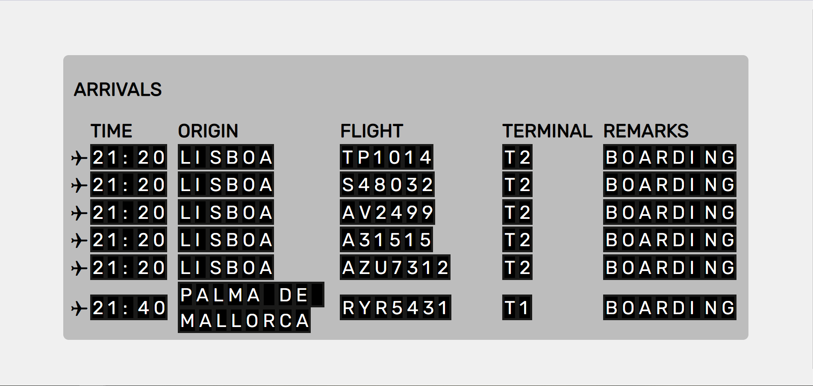

# flight-api-widget

Widget that displays flight arrival data at Madrid Barajas Airport, makes use of the API accessible at https://rapidapi.com/Rotanev/api/madrid-barajas-airport-flights/.

Uses nodemon for constant connection to API server, application aspect coded in vanilla JS.

## Instructions

In order to run the app please ensure node and npm is installed and added to PATH. After pulling this repo and navigating to local directory please enter the following command and follow instructions ```npm run start```. In the case packages such as axios HTTP client and Nodemon are not already installed npm will guide you through installation.

After starting the application via npm, the front end can be accessed by copying the absolute path of the client/index.html file into the browser with prefix ```file:///```

## Screenshots

